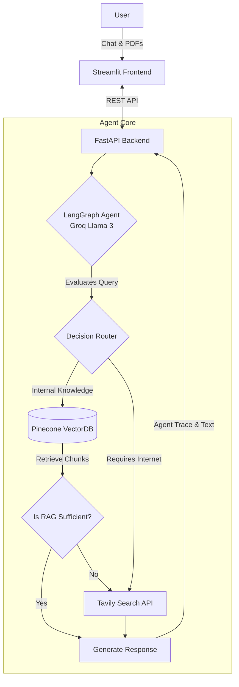

<div align="center">

# 🤖 Smart AI Agent: The Hybrid Knowledge Engine
### *Intelligently routing queries between a custom RAG knowledge base and real-time web search.*

[](https://www.python.org/)
[](https://langchain-ai.github.io/langgraph/)
[](https://groq.com/)
[](https://fastapi.tiangolo.com/)
[](https://streamlit.io/)
[](https://pinecone.io/)

<p align="center">
  <a href="#-overview">Overview</a> •
  <a href="#-key-features">Features</a> •
  <a href="#-architecture">Architecture</a> •
  <a href="#-setup-and-installation">Setup</a> •
  <a href="#-usage-and-api">Usage & API</a>
</p>
</div>

---

## 📖 Overview

The **Smart AI Agent** is a sophisticated, full-stack application capable of answering complex queries by intelligently bridging private knowledge and the public internet. 

Instead of relying solely on its training data, the agent dynamically routes user questions. It first attempts to use **Retrieval-Augmented Generation (RAG)** via a custom Pinecone vector database. If the retrieved internal knowledge is deemed insufficient by the LLM, or if the user explicitly requires internet access, the agent autonomously falls back to real-time web search using the **Tavily API**.

With a decoupled architecture featuring a **FastAPI** backend and a **Streamlit** frontend, this project is designed for scalability, transparency, and granular user control.

---

## ✨ Key Features

* **🔀 Intelligent Routing:** Combines internal RAG knowledge with real-time web search, dynamically selecting the best information source for each query.
* **🧠 Contextual RAG Sufficiency:** Employs the LLM to critically assess if retrieved RAG content is sufficient to answer a query. If not, it actively prevents incomplete responses by prompting further internet search.
* **🕵️ Transparent AI Workflow:** The UI features an "Agent Trace" that provides a detailed, step-by-step log of the agent's internal thought process, routing decisions, and retrieval summaries.
* **🎛️ User-Controlled Web Access:** A UI toggle allows users to strictly confine the agent to internal documents or grant it broader internet access.
* **📄 Dynamic Knowledge Ingestion:** Upload PDF documents directly through the UI to have them automatically chunked, embedded, and indexed into the Pinecone knowledge base.
* **💾 Persistent Memory:** Utilizes LangGraph's checkpointing to maintain conversation context and memory across multiple chat turns.

---

## 🏗️ Technical Architecture

The application is built on a clean, layered architecture ensuring separation of concerns between the user interface, API endpoints, and the LangGraph AI logic.



---

## 🛠️ Technology Stack

| Component | Technology | Role |
| --- | --- | --- |
| **Frontend** | **Streamlit** | Interactive chat UI, state management, and trace logs |
| **Backend API** | **FastAPI** | High-performance async API to handle requests |
| **Agent Core** | **LangGraph** | AI workflow orchestration, routing, and memory |
| **LLM Inference** | **Groq (Llama 3)** | Ultra-fast reasoning and text generation |
| **Search Engine** | **Tavily API** | Real-time internet search and scraping |
| **Embeddings** | **HuggingFace** | `all-MiniLM-L6-v2` for generating document vectors |
| **Vector Store** | **Pinecone** | Storing and retrieving embedded document chunks |

---

## 📂 Core Modules Structure

```text
agentBot/
├── frontend/
│   ├── app.py                  # Streamlit entry point
│   ├── ui_components.py        # Chat UI, toggle, trace
│   ├── backend_api.py          # API communication logic
│   ├── session_manager.py      # Streamlit state management
│   └── config.py               # Frontend configuration
│
├── backend/
│   ├── main.py                 # FastAPI entry point
│   ├── agent.py                # LangGraph AI agent workflow
│   ├── vectorstore.py          # Pinecone RAG logic & PyPDFLoader
│   └── config.py               # API keys and environment variables
│
├── requirements.txt            # Python dependencies
└── .env                        # Environment variables (Ignored in Git)

```

---

## 🚀 Setup and Installation

### 1. Prerequisites

Ensure you have **Python 3.9+** installed and the following accounts configured:

* **Pinecone:** Create an index named `rag-index` with `384` dimensions and the `cosine` metric.
* **API Keys:** You will need keys for Groq, Pinecone, and Tavily.

### 2. Clone & Environment

```bash
git clone [https://github.com/your-username/agentBot.git](https://github.com/your-username/agentBot.git)
cd agentBot
python -m venv venv
source venv/bin/activate  # On Windows: venv\Scripts\activate

```

### 3. Install Dependencies

```bash
pip install -r requirements.txt

```

### 4. Configuration

Create a `.env` file at the root of the project:

```env
GROQ_API_KEY="your_groq_api_key_here"
PINECONE_API_KEY="your_pinecone_api_key_here"
PINECONE_ENVIRONMENT="your_pinecone_environment"
TAVILY_API_KEY="your_tavily_api_key"
FASTAPI_BASE_URL="http://localhost:8000"

```

---

## 🏃 Running the Application

Because of the decoupled architecture, you need to start the backend and frontend separately.

**Terminal 1: Start the Backend (FastAPI)**

```bash
cd backend
uvicorn main:app --reload --host 0.0.0.0 --port 8000

```

**Terminal 2: Start the Frontend (Streamlit)**

```bash
cd ..
streamlit run frontend/app.py

```

---

## 🧪 Usage and API

While you can use the Streamlit UI, the FastAPI backend is fully accessible for testing via Postman or cURL.

### 1. Upload a Document (POST `/upload-document/`)

Uploads a PDF, chunks it, and indexes it into Pinecone.

* **Body:** `form-data`, key=`file`, type=`File`
* **Response:**

```json
{
  "message": "PDF 'doc.pdf' successfully uploaded and indexed.",
  "filename": "doc.pdf",
  "processed_chunks": 5
}

```

### 2. Chat with the Agent (POST `/chat/`)

Send a query and dictate web search permissions.

* **Body (JSON):**

```json
{
  "session_id": "test-session-001",
  "query": "What are the treatments for diabetes?",
  "enable_web_search": true
}

```

* **Response:**

```json
{
  "response": "Your agent's generated answer here...",
  "trace_events": [
    {
      "step": 1,
      "node_name": "router",
      "description": "Evaluated query and routed to Pinecone RAG.",
      "event_type": "router_decision"
    }
  ]
}

```

---

## 🗺️ Future Improvements

* [ ] **Tool Expansion:** Integrate tools like a calculator, calendar, or code interpreter.
* [ ] **Token Streaming:** Stream LLM output token-by-token to the frontend for a more responsive UI.
* [ ] **Advanced RAG:** Implement document re-ranking and multi-query translation.
* [ ] **User Authentication:** Add login profiles and persistent long-term memory databases for user chat history.

---

<div align="center">
<p>Built with ❤️ using LangGraph, Groq, and Streamlit</p>
<p><b>Star this repo if you find it helpful! ⭐</b></p>
</div>

```

```
